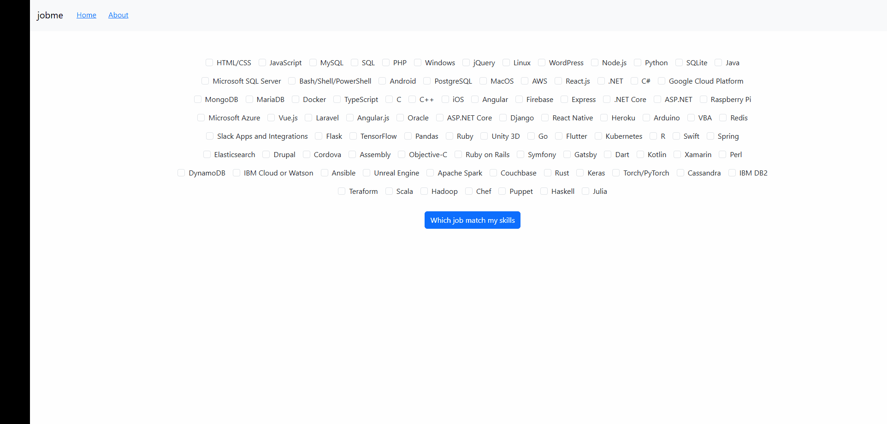

# jobme

<a target="_blank" href="https://cookiecutter-data-science.drivendata.org/">
    
</a>



**Find me the most suitable job based on my skillset**

As a fresh graduate student from an Intelligent, Interactive and Autonomous Systems (SIIA) Degree At the university of Western Brittany. Let's build a system that will help me find a job. 

## What is Jobme

**Jobme** is an AI-based system that suggests various IT stacks/jobs based on the user's skills.

## Why Build Jobme

I hold a bachelor degree in computer engineer. After that, I pursued a master degree in Intelligent, Interactive and Autonomous Systems. 

During the university, I built strong skills in various fields including back-end development, High Parallel Computing and Machine Learning.
The skills set required to work on these domains is wide. In fact, I learnt to code with different programming languages in different programming 
paradigms implementing different architectures. 

Looking for the first job is a challenge. With a large set of skills a candidate may become distracted and he/she may take an subjective career choice. 
The aim of this machine learning model is to make a rational decision based on existing data. 


## Project Organization

```
├── LICENSE            <- Open-source license if one is chosen
├── Makefile           <- Makefile with convenience commands like `make data` or `make train`
├── README.md          <- The top-level README for developers using this project.
├── data
│   ├── external       <- Data from third party sources.
│   ├── interim        <- Intermediate data that has been transformed.
│   ├── processed      <- The final, canonical data sets for modeling.
│   └── raw            <- The original, immutable data dump.
│
├── docs               <- A default mkdocs project; see www.mkdocs.org for details
│
├── models             <- Trained and serialized models, model predictions, or model summaries
│
├── notebooks          <- Jupyter notebooks. Naming convention is a number (for ordering),
│                         the creator's initials, and a short `-` delimited description, e.g.
│                         `1.0-jqp-initial-data-exploration`.
│
├── pyproject.toml     <- Project configuration file with package metadata for 
│                         jobme and configuration for tools like black
│
├── references         <- Data dictionaries, manuals, and all other explanatory materials.
│
├── reports            <- Generated analysis as HTML, PDF, LaTeX, etc.
│   └── figures        <- Generated graphics and figures to be used in 
│
├── script             <- Flask API that exposes a model via an endpoint
│
├── webui              <- Web user interface to interact with the model API             
│
├── requirements.txt   <- The requirements file for reproducing the analysis environment, e.g.
│                         generated with `pip freeze > requirements.txt`
│
├── setup.cfg          <- Configuration file for flake8
│
└── jobme   <- Source code for use in this project.
    │
    ├── __init__.py             <- Makes jobme a Python module
    │
    ├── config.py               <- Store useful variables and configuration
    │
    ├── dataset.py              <- Scripts to download or generate data
    │
    ├── features.py             <- Code to create features for modeling
    │
    ├── modeling                
    │   ├── __init__.py 
    │   ├── predict.py          <- Code to run model inference with trained models          
    │   └── train.py            <- Code to train models
    │
    └── plots.py                <- Code to create visualizations
```

--------

## What to contribute ? 

Raise an issue or contact the author via : 

contact.mellouky@gmail.com
